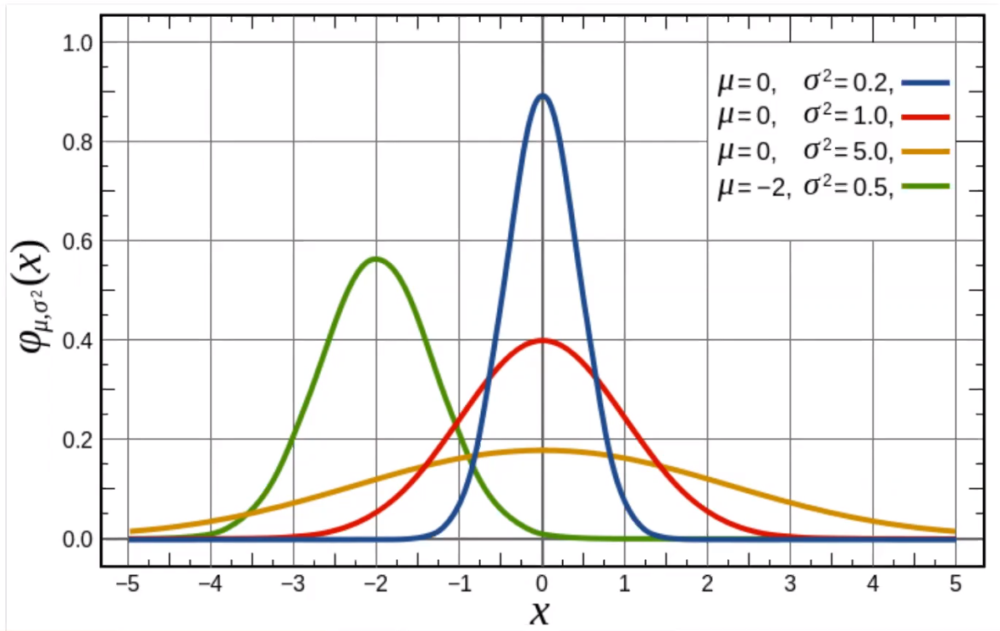

# Variables Aleatorias Continuas

\- $X$ toma valores en un subconjunto continuo de $\!R^d$. -> su recorrido es ==no finito ni numerable==. $X$ se dice continua. En este caso **No podemos enumerar sus posibles valores**.
 
 \* Por simplicidad solo se analizara d = 1, univariado.
 
 ### Caso Discreto
 
 $f(x) = P(X = x_k)$
 
 $X$ puede tomar valores infinitos, asi que se aplican integrales. (Area bajo la curva)
 
 >Prob de que la variable pertenezca a un intervalo a y b**
 >$$P(a \leq x \leq b) = \int_{a}^{b} f(t) \,dt$$
 > f(t)** es una funcion de probabilidad
	 > $f(t) \geq 0$        $\forall t$
	 > $f(t) \leq 1$        $\forall t$
	 > $P(\Omega) = 1$

#### Funcion de distribución

La funcion de dist de $X$ se define como:

$$F(x) = P(X \leq x) = \int_{-\infty}^{x}f(t)dt$$

---

### Distribuciones Notables

#### Distribución uniforme

Si una v.a. esta dentro de un intervalo, tiene la misma probabilida en este (fdp).
$$  
f(x) = 
     \begin{cases}
       0 &\quad \text{si } x \not \in [a,b]\\
       \frac{1}{b-a} &\quad \text{si } x \in [a,b]\\
     \end{cases}
$$
 Se nota $X \sim U(a,b)$.
 *Es la func que se grafica como un rectangulo.
 
 $$E(X) = \frac{b+a}{2}$$
 $$F^{-1}(0.5) = \frac{b+a}{2}$$ -> mediana
 $$E(X) = \frac{(b-a)^2}{2}$$
 >cuando $E(X) = F^{-1}(x)$ Es una distribucion simetrica :)
 #### Distribución Normal

$$f(x) = \frac{1}{\sqrt{2\pi}\sigma}exp({-\frac{(x - \mu)^2}{2\sigma^2}})$$

Se nota $x \sim N(\mu , \sigma^2$)

 $$E(X) = \mu$$
 $$F^{-1}(0.5) = \mu$$ 
 $$V(X) = \sigma^2$$
 
 \* Como le afectan $\mu$ y $\sigma$ a la distribución normal:

Para interpretar donde se mueven los datos y analizar los gráficos:

#### Distribucón  Normal Estandar

$$f(z) = \frac{1}{\sqrt2\pi}exp(-\frac{z^2}{2})$$

Anotamos, $Z \sim N(0,1)$

 $$E(Z) = 0$$
 $$F^{-1}(0.5) = 0$$ 
 $$E(Z) = 1$$

No existe una forma de calcular esta integral, asi que podemos aproximar su valor usando tecnicas computacionales. El problema de esto es que habria que hacer una app para cada $\mu$ y $\sigma$ posible.

La sol mas conveniente es **estandarizar la variable aleatoria**.

>##### Teorema - Estandarización
>Sea $X \sim N(\mu,\sigma^2)$. Defina
>$$Z = \frac{X-\mu}{\sigma}.$$
>Entonces $Z \sim N(0,1)$ es decir $Z$ sigue una distribucion normal estándar. 

$$P(a \leq X \leq b) = P(\frac{a-\mu}{\sigma} \leq \frac{X-\mu}{\sigma} \leq \frac{b-\mu}{\sigma})$$

La solución:

$$F(z) = \Phi(z) = \int_{-\infty}^{z} \frac{1}{\sqrt{2\pi}}exp\left( -\frac{t^2}{2}\right)$$

$\Phi(z)$ es la app del área  bajo la curva. *Recordar que esto es solo para la distribucion normal estandar*. 

Buscaremos valores en tablas dadas. 
Si queremos el valor de $\Phi(0.53)$ lo buscamos como la combi de la fila 0.5 y la columna 0.03.

Las tablas son para la normal estandar con $X\sim N(0,1)$. En el caso diferente podemos realizar la transformación,

$X \sim N(4,6).$ Calcular $P(-2 \leq X \leq 4)$. -> $\Phi\left(\frac{4-4}{\sqrt{6}}\right) - \Phi\left(\frac{-2-4}{\sqrt{6}}\right)$

---

Ya que la desviacion estandar es simétrica:
$$\Phi(-z) = 1 - \Phi(z)$$
---

#### Percentiles de la distribución normal:

Denotamos $z_\alpha$ al $100 (1-\alpha)$-ésimo percentil de la dist. normal.

el $100 (1-\alpha)$-ésimo percentil de una distribucion normal con valor esperado $\mu$ y desviación estándar $\sigma$ está dado por:

$$\eta(1 -\alpha) = \mu + z_\alpha \sigma$$

#### Distribución exponencial

Solo esta definida para $x \geq 0$, con parametro $\theta$.

$$  
f(x) = 
     \begin{cases}
       0 &\quad \text{si } x < 0\\
       \frac{1}{\theta}exp\left(-\frac{x}{\theta}\right) &\quad \text{si } x \geq 0\\
     \end{cases}
$$

Anotamos, $X \sim Exp( \theta)$.

Notacion alternativa equivalente:

$$  
f(x) = 
     \begin{cases}
       0 &\quad \text{si } x < 0\\
       \lambda exp(-\lambda x) &\quad \text{si } x \geq 0\\
     \end{cases}
$$

*Recordar que f(x) es su f.d.p.*

Anotamos, $X \sim Exp( \lambda)$.

 $$E(X) = \theta = \frac{1}{\lambda}$$
 $$F^{-1}(0.5) = \theta ln(2) = \frac{1}{\lambda}ln(2)$$ 
 $$V(Z) = \theta ^2 = \lambda ^{-2}$$

Ahora podemos conocer explicitamente la forma de la distribución,

$$F(x) = P(X\leq x) = \int_{0}^{x} \frac{1}{\theta} exp \left(- \frac{t}{\theta} \right) = 1 - exp \left(- \frac{x}{\theta} \right) $$

**Exponencial de Poisson**

Con $X$ ocurrencias de un fenomeno por unidad de tiempo, sigue la distribución:

$$P(X=k) = \frac{\lambda^ke^{-\lambda}}{k!}$$

Con $T$ el tiempo que pasa entre las ocurrencias sucesivas del evento,

$$  
f(t) = 
     \begin{cases}
       0 &\quad \text{si } t < 0\\
       \lambda exp(-\lambda t) &\quad \text{si } t \geq 0\\
     \end{cases}
$$

La dist. exp. no tiene memoria,  no influye la ocurrencia de un evento anterior.

#### Distribución Gama

[[estaca]]